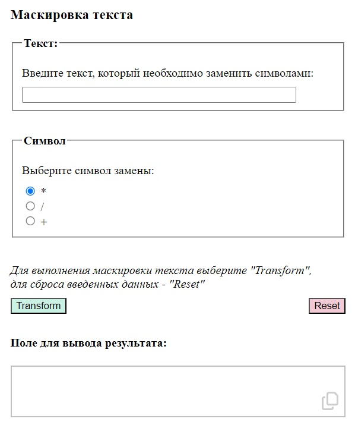

# Hide letters application (HTML | CSS | JS)

## О проекте
Приложение позволяет заменить каждую букву введенного пользователем текста на символ, который он выбирает из предложенного списка (по умолчанию - на звездочку "*"). В результате выдается "замаскированный" текст.

**Использование**  
Приложение можно использовать, чтобы задать вопрос боту в чате (там где само содержание вопроса для бота не имеет значения, например, чтобы получить в ответ рандомное число). При этом текст вопроса скрывается от остальных участников чата. 

**Инструменты:** 

**Языки:** 
 
 
 

**Демо:** [Перейти на сайт](https://the-all-spark.github.io/hide_letters_app/) 

## Реализованный функционал:
1. замена каждого символа (кроме пробела) в введенном тексте на символ, выбранный пользователем из списка;
2. при клике на кнопку "Transform" - преобразование текста, на кнопку "Reset" - сброс введенных данных;
3. при клике на иконку "Скопировать" - копирование преобразованного текста в буфер обмена и вывод сообщения "Текст скопирован!";
4. сообщение удаляется при введении нового запроса и отправки формы заново ("Transform"), а также при сбросе введенных ранее данных ("Reset").